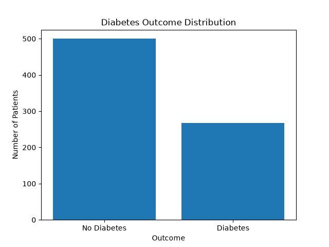

# پروژه ۱: تحلیل احتمال دیابت در جمعیت Pima Indian

## مقدمه

احتمال یکی از مفاهیم مهم در تحلیل داده‌های پزشکی است. با استفاده از احتمال می‌توان میزان رخداد یک وضعیت پزشکی را در داده‌های واقعی بررسی و نتایج مشاهده‌شده را با حالت‌های نظری مقایسه کرد.

در این پروژه از دیتاست **Pima Indians Diabetes Dataset** استفاده شده است. این دیتاست شامل اطلاعات **768 فرد** و **9 ستون** است.

8 ستون شامل ویژگی‌های پزشکی هستند و یک ستون به نام `Outcome` وضعیت دیابت فرد را نشان می‌دهد.

در ستون `Outcome`:

- مقدار `0` نشان‌دهنده فرد غیردیابتی است.
- مقدار `1` نشان‌دهنده فرد دیابتی است.

هدف این پروژه بررسی فضای نمونه، رویدادها، احتمال تجربی، احتمال کلاسیک و تفاوت بین آن‌ها با استفاده از داده‌های واقعی است.

---

# 1. معرفی دیتاست

ستون‌های دیتاست عبارت‌اند از:

- `Pregnancies`: تعداد بارداری
- `Glucose`: میزان گلوکز پلاسما
- `BloodPressure`: فشار خون دیاستولیک
- `SkinThickness`: ضخامت چین پوستی
- `Insulin`: میزان انسولین سرم
- `BMI`: شاخص توده بدنی
- `DiabetesPedigreeFunction`: تابع تبار دیابت
- `Age`: سن
- `Outcome`: وضعیت دیابت

پس از بارگذاری دیتاست با کتابخانه `pandas`، شکل داده به صورت زیر به دست آمد:

```text
(768, 9)
```

بنابراین دیتاست شامل:

- **768 ردیف**
- **9 ستون**

است.

---

# 2. تعریف فضای نمونه و رویدادها

فضای نمونه شامل تمام حالت‌های ممکن یک آزمایش است.

در این پروژه آزمایش موردنظر، بررسی وضعیت دیابت یک فرد است.

برای هر فرد فقط دو حالت ممکن وجود دارد:

```text
S = {0, 1}
```

که در آن:

- `0` = غیردیابتی
- `1` = دیابتی

بنابراین فضای نمونه شامل دو حالت دیابتی و غیردیابتی است.

## رویداد دیابتی بودن

رویداد دیابتی بودن را با `D` نمایش می‌دهیم:

```text
D = {1}
```

یعنی هر فردی که مقدار `Outcome` او برابر `1` باشد، در رویداد دیابتی بودن قرار می‌گیرد.

## رویداد غیردیابتی بودن

رویداد غیردیابتی بودن را می‌توان به صورت زیر نمایش داد:

```text
Dᶜ = {0}
```

یعنی هر فردی که مقدار `Outcome` او برابر `0` باشد، غیردیابتی در نظر گرفته می‌شود.

---

# 3. روش‌شناسی

ابتدا دیتاست با استفاده از کتابخانه `pandas` بارگذاری شد.

سپس تعداد مقادیر مختلف ستون `Outcome` محاسبه شد.

نتیجه شمارش به صورت زیر بود:

```text
Outcome
0    500
1    268
```

بنابراین:

- تعداد افراد غیردیابتی = **500 نفر**
- تعداد افراد دیابتی = **268 نفر**
- تعداد کل افراد = **768 نفر**

برای محاسبه احتمال تجربی از رابطه زیر استفاده شد:

```text
احتمال تجربی = تعداد وقوع رویداد / تعداد کل مشاهدات
```

---

# 4. محاسبه احتمال تجربی

## احتمال تجربی دیابت

تعداد افراد دیابتی برابر با 268 نفر است.

بنابراین:

```text
P(D) = 268 / 768
```

نتیجه:

```text
P(D) ≈ 0.349
```

برای تبدیل این مقدار به درصد:

```text
0.349 × 100 ≈ 34.9%
```

بنابراین احتمال تجربی دیابت در این دیتاست تقریباً:

```text
34.9%
```

است.

---

## احتمال تجربی عدم دیابت

تعداد افراد غیردیابتی برابر با 500 نفر است.

بنابراین:

```text
P(No Diabetes) = 500 / 768
```

نتیجه:

```text
P(No Diabetes) ≈ 0.651
```

برای تبدیل این مقدار به درصد:

```text
0.651 × 100 ≈ 65.1%
```

بنابراین احتمال تجربی عدم دیابت تقریباً:

```text
65.1%
```

است.

---

## بررسی مجموع احتمالات

چون فضای نمونه فقط شامل دو حالت دیابتی و غیردیابتی است، مجموع احتمال این دو حالت باید برابر 1 باشد:

```text
P(Diabetes) + P(No Diabetes) = 1
```

در این پروژه:

```text
0.349 + 0.651 = 1
```

یا به صورت درصد:

```text
34.9% + 65.1% = 100%
```

بنابراین محاسبات درست هستند.

---

# 5. احتمال کلاسیک

اگر فرض کنیم دو حالت دیابتی و غیردیابتی به یک اندازه محتمل باشند، احتمال کلاسیک دیابت برابر است با:

```text
P(Diabetes) = 1 / 2
```

بنابراین:

```text
P(Diabetes) = 0.5
```

یا:

```text
P(Diabetes) = 50%
```

در احتمال کلاسیک فرض می‌شود دو نتیجه ممکن دارای احتمال یکسان هستند.

---

# 6. مقایسه احتمال کلاسیک و تجربی

احتمال کلاسیک دیابت:

```text
50%
```

احتمال تجربی دیابت در دیتاست:

```text
34.9%
```

این دو مقدار با یکدیگر متفاوت هستند.

دلیل این تفاوت آن است که احتمال کلاسیک بر اساس فرض هم‌احتمال بودن دو حالت محاسبه می‌شود، در حالی که احتمال تجربی بر اساس مشاهدات واقعی موجود در دیتاست محاسبه می‌شود.

در داده‌های واقعی:

```text
268 نفر دیابتی
500 نفر غیردیابتی
```

بنابراین تعداد افراد دیابتی و غیردیابتی برابر نیست.

در نتیجه طبیعی است که احتمال تجربی دیابت با مقدار کلاسیک `0.5` متفاوت باشد.

---

# 7. نمودار توزیع Outcome

برای نمایش بهتر تعداد افراد دیابتی و غیردیابتی، نمودار میله‌ای توزیع `Outcome` رسم شد.

در این نمودار:

- محور افقی وضعیت دیابت را نشان می‌دهد.
- محور عمودی تعداد افراد را نشان می‌دهد.
- میله `No Diabetes` مربوط به 500 فرد غیردیابتی است.
- میله `Diabetes` مربوط به 268 فرد دیابتی است.

نمودار با نام زیر ذخیره شده است:

```text
outcome_distribution.png
```



این نمودار نشان می‌دهد که تعداد افراد غیردیابتی در این دیتاست بیشتر از افراد دیابتی است.

---

# 8. تفسیر نتایج

نتایج نشان داد که در این دیتاست:

```text
احتمال تجربی دیابت ≈ 34.9%
```

و:

```text
احتمال تجربی عدم دیابت ≈ 65.1%
```

است.

این نتایج از داده‌های مشاهده‌شده به دست آمده‌اند و برخلاف احتمال کلاسیک، نیازی به فرض هم‌احتمال بودن دو حالت ندارند.

این موضوع نشان می‌دهد که وجود دو نتیجه ممکن لزوماً به این معنی نیست که هر نتیجه با احتمال 50 درصد رخ می‌دهد.

---

# 9. تفسیر پزشکی

در داده‌های مورد بررسی، تقریباً 35 درصد افراد دارای `Outcome = 1` هستند.

این عدد نشان‌دهنده فراوانی دیابت در همین دیتاست است.

بنابراین مقدار:

```text
34.9%
```

را نباید بدون بررسی بیشتر به عنوان احتمال دیابت برای هر فرد یا برای هر جمعیت دیگری در نظر گرفت.

این مقدار فقط نتیجه مشاهده‌شده در همین مجموعه داده است.

---

# 10. محدودیت‌ها

مهم‌ترین محدودیت این تحلیل آن است که داده‌ها مربوط به یک جمعیت مشخص از زنان Pima Indian هستند.

بنابراین احتمال تجربی محاسبه‌شده:

```text
34.9%
```

تنها فراوانی مشاهده‌شده در همین دیتاست را نشان می‌دهد.

نمی‌توان بدون داشتن داده‌ها و شواهد مناسب، این مقدار را مستقیماً به تمام زنان جهان یا سایر جمعیت‌ها تعمیم داد.

همچنین احتمال تجربی به نمونه مورد بررسی وابسته است.

اگر نمونه دیگری از افراد بررسی شود، تعداد افراد دیابتی و در نتیجه احتمال تجربی نیز ممکن است متفاوت باشد.

---

# 11. پاسخ به پرسش‌های تحلیلی

## سؤال 1: فضای نمونه این آزمایش چیست؟

فضای نمونه شامل تمام حالت‌های ممکن وضعیت دیابت است:

```text
S = {0, 1}
```

که در آن:

- `0` = غیردیابتی
- `1` = دیابتی

---

## سؤال 2: رویداد «دیابتی بودن» را چگونه تعریف کردید؟

رویداد دیابتی بودن را با `D` نمایش می‌دهیم:

```text
D = {1}
```

یعنی هر فردی که مقدار `Outcome` او برابر `1` باشد، عضو رویداد دیابتی بودن است.

---

## سؤال 3: احتمال تجربی دیابت چقدر است؟ احتمال عدم دیابت چطور؟

تعداد افراد دیابتی برابر با 268 نفر و تعداد کل افراد برابر با 768 نفر است.

بنابراین:

```text
P(Diabetes) = 268 / 768
P(Diabetes) ≈ 0.349
P(Diabetes) ≈ 34.9%
```

برای عدم دیابت:

```text
P(No Diabetes) = 500 / 768
P(No Diabetes) ≈ 0.651
P(No Diabetes) ≈ 65.1%
```

بنابراین:

- احتمال تجربی دیابت ≈ **34.9%**
- احتمال تجربی عدم دیابت ≈ **65.1%**

---

## سؤال 4: چرا احتمال کلاسیک 0.5 با احتمال تجربی متفاوت است؟

احتمال کلاسیک `0.5` بر اساس این فرض به دست می‌آید که دو حالت دیابتی و غیردیابتی به یک اندازه محتمل هستند.

اما در داده‌های واقعی تعداد این دو گروه برابر نیست.

در این دیتاست:

```text
268 نفر دیابتی
500 نفر غیردیابتی
```

هستند.

به همین دلیل احتمال تجربی دیابت برابر است با:

```text
268 / 768 ≈ 0.349
```

در حالی که احتمال کلاسیک برابر است با:

```text
0.5
```

احتمال کلاسیک بر اساس یک فرض نظری است، در حالی که احتمال تجربی از داده‌های واقعی مشاهده‌شده محاسبه می‌شود.

---

## سؤال 5: اگر تعداد بیماران 1000 نفر بود، احتمال تجربی چگونه تغییر می‌کرد؟

احتمال تجربی به نسبت تعداد افراد دیابتی به تعداد کل افراد بستگی دارد، نه فقط به تعداد کل افراد.

در دیتاست فعلی:

```text
P(Diabetes) = 268 / 768 ≈ 0.349
```

اگر تعداد افراد به 1000 نفر افزایش پیدا کند و نسبت افراد دیابتی تقریباً مشابه نمونه فعلی باقی بماند، انتظار داریم حدود 349 نفر دیابتی باشند:

```text
0.349 × 1000 ≈ 349
```

در این حالت:

```text
P(Diabetes) = 349 / 1000 = 0.349
```

بنابراین احتمال تجربی تقریباً همان:

```text
34.9%
```

باقی می‌ماند.

اما اگر در نمونه 1000 نفری نسبت افراد دیابتی تغییر کند، احتمال تجربی نیز تغییر خواهد کرد.

---

## سؤال 6: چرا در پزشکی معمولاً از احتمال تجربی استفاده می‌کنیم؟

در مسائل پزشکی معمولاً با داده‌های واقعی افراد و بیماران سروکار داریم.

احتمال تجربی بر اساس تعداد واقعی وقوع یک رویداد در داده‌های مشاهده‌شده محاسبه می‌شود.

برای مثال، در این پروژه اگر فقط از احتمال کلاسیک استفاده کنیم، احتمال دیابت را برابر با:

```text
50%
```

در نظر می‌گیریم.

اما داده‌های واقعی نشان می‌دهند:

```text
P(Diabetes) ≈ 34.9%
```

بنابراین احتمال تجربی می‌تواند وضعیت واقعی نمونه مورد بررسی را بهتر از یک فرض ساده مانند هم‌احتمال بودن دو حالت توصیف کند.

---

## سؤال 7: آیا احتمال تجربی این دیتاست را می‌توان به کل زنان جهان تعمیم داد؟ چرا؟

خیر.

نمی‌توان این احتمال را بدون بررسی‌های بیشتر مستقیماً به کل زنان جهان تعمیم داد.

این دیتاست مربوط به جمعیت مشخصی از زنان Pima Indian است و ویژگی‌های این جمعیت ممکن است با سایر جمعیت‌ها متفاوت باشد.

بنابراین مقدار:

```text
P(Diabetes) ≈ 34.9%
```

فقط احتمال تجربی مشاهده‌شده در همین دیتاست است.

برای تعمیم نتیجه به جمعیت‌های دیگر، به داده‌ها و نمونه‌های مناسب از آن جمعیت‌ها نیاز داریم.

---

# 12. نتیجه‌گیری

در این پروژه مفهوم احتمال با استفاده از داده‌های واقعی مربوط به دیابت بررسی شد.

دیتاست شامل 768 فرد بود که از میان آن‌ها:

```text
268 نفر دیابتی
500 نفر غیردیابتی
```

بودند.

احتمال تجربی دیابت برابر با:

```text
268 / 768 ≈ 0.349 ≈ 34.9%
```

و احتمال تجربی عدم دیابت برابر با:

```text
500 / 768 ≈ 0.651 ≈ 65.1%
```

به دست آمد.

همچنین احتمال کلاسیک دیابت با فرض هم‌احتمال بودن دو حالت برابر با:

```text
0.5 = 50%
```

بود.

مقایسه این دو مقدار نشان داد که احتمال کلاسیک و تجربی لزوماً برابر نیستند.

احتمال تجربی از داده‌های مشاهده‌شده به دست می‌آید و وضعیت نمونه مورد بررسی را توصیف می‌کند، در حالی که احتمال کلاسیک به فرض‌های نظری وابسته است.

در نهایت، نتایج این پروژه نشان می‌دهد که برای تحلیل داده‌های پزشکی، توجه به داده‌های واقعی و همچنین محدودیت‌های جمعیت مورد مطالعه اهمیت زیادی دارد.