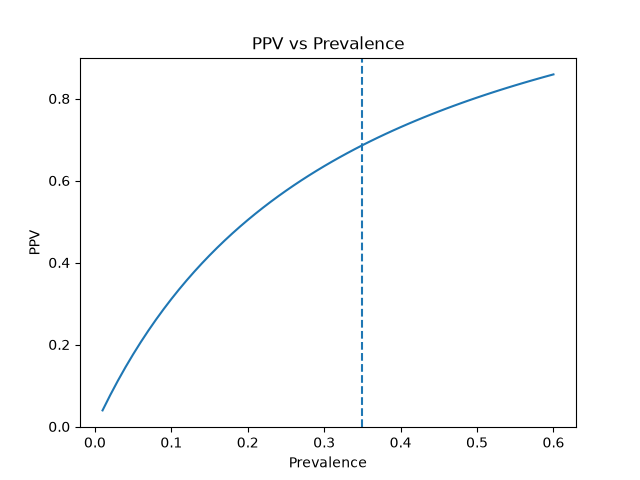

# پروژه ۲: ارزیابی ارزش تشخیصی تست گلوکز با قضیه بیز

## مقدمه

تست‌های تشخیصی یکی از ابزارهای مهم در پزشکی هستند، اما مثبت یا منفی شدن یک تست به‌تنهایی برای تشخیص بیماری کافی نیست.

برای تفسیر درست نتیجه یک تست باید عواملی مانند حساسیت، ویژگی، شیوع بیماری، ارزش اخباری مثبت و ارزش اخباری منفی را نیز در نظر گرفت.

در این پروژه از **Pima Indians Diabetes Dataset** استفاده شده است.

هدف اصلی این است که بررسی کنیم:

> اگر مقدار گلوکز فرد برابر یا بیشتر از 140 باشد و تست او مثبت در نظر گرفته شود، احتمال اینکه فرد واقعاً دیابتی باشد چقدر است؟

---

# 1. معرفی دیتاست

در این پروژه از همان دیتاست پروژه ۱ استفاده شده است.

ستون‌های اصلی دیتاست عبارت‌اند از:

- `Pregnancies`
- `Glucose`
- `BloodPressure`
- `SkinThickness`
- `Insulin`
- `BMI`
- `DiabetesPedigreeFunction`
- `Age`
- `Outcome`

ستون `Outcome` وضعیت واقعی دیابت را مشخص می‌کند:

- `Outcome = 0` → فرد غیردیابتی
- `Outcome = 1` → فرد دیابتی

تعداد کل افراد موجود در دیتاست:

```text
768
```

تعداد افراد دیابتی:

```text
268
```

تعداد افراد غیردیابتی:

```text
500
```

---

# 2. تعریف تست گلوکز

در این پروژه تست تشخیصی بر اساس مقدار `Glucose` تعریف شد.

اگر:

```text
Glucose >= 140
```

باشد، تست مثبت در نظر گرفته می‌شود.

اگر:

```text
Glucose < 140
```

باشد، تست منفی در نظر گرفته می‌شود.

برای این کار یک ستون جدید با نام `Test_Positive` ساخته شد.

در این ستون:

- `1` = تست مثبت
- `0` = تست منفی

کد مربوط به این بخش:

```python
df["Test_Positive"] = (df["Glucose"] >= 140).astype(int)
```

---

# 3. چهار حالت اصلی تست تشخیصی

برای بررسی عملکرد تست، چهار حالت اصلی در نظر گرفته شد.

## True Positive - TP

فرد واقعاً دیابتی است و تست نیز مثبت شده است.

```text
Outcome = 1
Test_Positive = 1
```

تعداد:

```text
TP = 135
```

---

## False Positive - FP

فرد واقعاً دیابتی نیست، اما تست او مثبت شده است.

```text
Outcome = 0
Test_Positive = 1
```

تعداد:

```text
FP = 62
```

---

## True Negative - TN

فرد واقعاً غیردیابتی است و تست نیز منفی شده است.

```text
Outcome = 0
Test_Positive = 0
```

تعداد:

```text
TN = 438
```

---

## False Negative - FN

فرد واقعاً دیابتی است، اما تست او منفی شده است.

```text
Outcome = 1
Test_Positive = 0
```

تعداد:

```text
FN = 133
```

---

# 4. بررسی صحت تعدادها

کل افراد دیابتی:

```text
TP + FN
= 135 + 133
= 268
```

کل افراد غیردیابتی:

```text
TN + FP
= 438 + 62
= 500
```

و در نهایت:

```text
135 + 62 + 438 + 133 = 768
```

بنابراین تمام افراد دیتاست در یکی از چهار حالت اصلی قرار گرفته‌اند.

---

# 5. شیوع دیابت - Prevalence

شیوع نشان می‌دهد چه نسبتی از کل افراد واقعاً بیماری را دارند.

فرمول:

```text
Prevalence = تعداد افراد دیابتی / تعداد کل افراد
```

برای این دیتاست:

```text
Prevalence = 268 / 768
```

نتیجه:

```text
Prevalence ≈ 0.349
```

یا:

```text
Prevalence ≈ 34.9%
```

بنابراین حدود 34.9 درصد افراد این دیتاست واقعاً دیابتی هستند.

---

# 6. حساسیت - Sensitivity

حساسیت پاسخ این سؤال را می‌دهد:

> از بین افرادی که واقعاً دیابتی هستند، تست چند درصد را به درستی مثبت تشخیص می‌دهد؟

فرمول:

```text
Sensitivity = TP / (TP + FN)
```

در این پروژه:

```text
Sensitivity = 135 / (135 + 133)
```

بنابراین:

```text
Sensitivity ≈ 0.5037
```

یا:

```text
Sensitivity ≈ 50.4%
```

این یعنی تست با آستانه 140 فقط حدود نیمی از افراد واقعاً دیابتی را مثبت تشخیص داده است.

---

# 7. ویژگی - Specificity

ویژگی پاسخ این سؤال را می‌دهد:

> از بین افرادی که واقعاً دیابتی نیستند، تست چند درصد را به درستی منفی تشخیص می‌دهد؟

فرمول:

```text
Specificity = TN / (TN + FP)
```

در این پروژه:

```text
Specificity = 438 / (438 + 62)
```

بنابراین:

```text
Specificity = 0.876
```

یا:

```text
Specificity = 87.6%
```

بنابراین تست در تشخیص افراد غیردیابتی عملکرد بهتری نسبت به تشخیص افراد دیابتی داشته است.

---

# 8. نرخ مثبت کاذب - False Positive Rate

نرخ مثبت کاذب نشان می‌دهد چه نسبتی از افراد غیردیابتی به اشتباه تست مثبت گرفته‌اند.

فرمول:

```text
FPR = 1 - Specificity
```

بنابراین:

```text
FPR = 1 - 0.876
```

نتیجه:

```text
FPR = 0.124
```

یا:

```text
FPR = 12.4%
```

---

# 9. ارزش اخباری مثبت - PPV

PPV پاسخ یکی از مهم‌ترین سؤال‌های پروژه است:

> اگر تست فرد مثبت شود، احتمال اینکه واقعاً دیابتی باشد چقدر است؟

فرمول مستقیم:

```text
PPV = TP / (TP + FP)
```

در این پروژه:

```text
PPV = 135 / (135 + 62)
```

یعنی:

```text
PPV = 135 / 197
```

نتیجه:

```text
PPV ≈ 0.6853
```

یا:

```text
PPV ≈ 68.5%
```

بنابراین اگر تست گلوکز فرد با آستانه 140 مثبت شود، در این دیتاست احتمال اینکه فرد واقعاً دیابتی باشد حدود **68.5 درصد** است.

---

# 10. ارزش اخباری منفی - NPV

NPV پاسخ این سؤال را می‌دهد:

> اگر تست فرد منفی شود، احتمال اینکه واقعاً غیردیابتی باشد چقدر است؟

فرمول:

```text
NPV = TN / (TN + FN)
```

در این پروژه:

```text
NPV = 438 / (438 + 133)
```

یعنی:

```text
NPV = 438 / 571
```

نتیجه:

```text
NPV ≈ 0.7671
```

یا:

```text
NPV ≈ 76.7%
```

بنابراین اگر تست منفی شود، احتمال اینکه فرد واقعاً غیردیابتی باشد حدود **76.7 درصد** است.

---

# 11. محاسبه احتمال مثبت شدن تست

برای استفاده از قضیه بیز ابتدا احتمال مثبت شدن تست محاسبه شد.

فرمول:

```text
P(T+) =
(Sensitivity × Prevalence)
+
(FPR × (1 - Prevalence))
```

با قرار دادن مقادیر:

```text
Sensitivity ≈ 0.5037
Prevalence ≈ 0.349
FPR = 0.124
```

نتیجه:

```text
P(T+) ≈ 0.2565
```

یا:

```text
P(T+) ≈ 25.65%
```

بنابراین حدود 25.65 درصد افراد دیتاست تست مثبت داشته‌اند.

---

# 12. محاسبه PPV با قضیه بیز

PPV با استفاده از قضیه بیز به صورت زیر محاسبه شد:

```text
PPV =
(Sensitivity × Prevalence)
/
P(T+)
```

نتیجه:

```text
PPV ≈ 0.6853
```

یا:

```text
PPV ≈ 68.5%
```

این مقدار دقیقاً با PPV محاسبه‌شده از روش مستقیم برابر بود.

روش مستقیم:

```text
TP / (TP + FP) ≈ 68.5%
```

روش بیز:

```text
(Sensitivity × Prevalence) / P(T+) ≈ 68.5%
```

برابر بودن این دو نتیجه نشان می‌دهد محاسبات با یکدیگر سازگار هستند.

---

# 13. احتمال منفی شدن تست

احتمال منفی شدن تست نیز محاسبه شد:

```text
P(T-) =
Specificity × (1 - Prevalence)
+
(1 - Sensitivity) × Prevalence
```

نتیجه:

```text
P(T-) ≈ 0.7435
```

یا:

```text
P(T-) ≈ 74.35%
```

---

# 14. محاسبه NPV با روش احتمالاتی

NPV نیز با استفاده از احتمال منفی شدن تست محاسبه شد:

```text
NPV =
Specificity × (1 - Prevalence)
/
P(T-)
```

نتیجه:

```text
NPV ≈ 0.7671
```

یا:

```text
NPV ≈ 76.7%
```

این عدد نیز با NPV محاسبه‌شده به روش مستقیم برابر بود.

---

# 15. بررسی اثر شیوع بر PPV

در مرحله بعد بررسی شد که تغییر شیوع بیماری چه اثری بر PPV دارد.

شیوع از:

```text
1%
```

تا:

```text
60%
```

تغییر داده شد.

Sensitivity و Specificity ثابت نگه داشته شدند و برای هر مقدار شیوع، PPV دوباره محاسبه شد.

چند نمونه از نتایج:

```text
Prevalence = 1%   → PPV ≈ 3.9%
Prevalence = 10%  → PPV ≈ 31.1%
Prevalence = 20%  → PPV ≈ 50.4%
Prevalence = 35%  → PPV ≈ 68.6%
Prevalence = 60%  → PPV ≈ 85.9%
```

این نتایج نشان می‌دهند:

```text
شیوع پایین‌تر → PPV پایین‌تر
شیوع بالاتر   → PPV بالاتر
```

بنابراین ارزش یک تست مثبت فقط به ویژگی‌های خود تست وابسته نیست و شیوع بیماری در جمعیت نیز نقش بسیار مهمی دارد.

---

# 16. نمودار PPV در برابر شیوع

برای نمایش بهتر رابطه بین شیوع و PPV، نمودار زیر رسم شد:

```text
ppv_vs_prevalence.png
```



محور افقی نشان‌دهنده شیوع بیماری و محور عمودی نشان‌دهنده PPV است.

همچنین یک خط عمودی در شیوع فعلی دیتاست یعنی حدود 34.9 درصد رسم شد.

نمودار نشان می‌دهد که با افزایش شیوع دیابت، PPV نیز افزایش پیدا می‌کند.

---

# 17. Base Rate Fallacy

Base Rate Fallacy یا «خطای نادیده گرفتن نرخ پایه» زمانی اتفاق می‌افتد که نتیجه یک تست را بدون توجه کافی به شیوع اولیه بیماری تفسیر کنیم.

برای مثال ممکن است تصور کنیم:

> اگر تست فرد مثبت شده است، احتمال بیماری او باید بسیار زیاد باشد.

اما این نتیجه همیشه درست نیست.

در این پروژه مشاهده شد که اگر شیوع فقط 1 درصد باشد:

```text
PPV ≈ 3.9%
```

یعنی حتی با مثبت شدن تست، احتمال واقعی دیابت فقط حدود 3.9 درصد خواهد بود.

اما با شیوع حدود 35 درصد:

```text
PPV ≈ 68.6%
```

می‌شود.

بنابراین هنگام تفسیر تست پزشکی نباید فقط به نتیجه مثبت یا منفی تست توجه کرد و باید شیوع بیماری در جمعیت را نیز در نظر گرفت.

---

# 18. آیا این تست برای غربالگری عمومی مناسب است؟

حساسیت تست در این پروژه حدود:

```text
50.4%
```

بود.

همچنین:

```text
FN = 133
```

یعنی 133 نفر واقعاً دیابتی بوده‌اند اما تست با آستانه 140 برای آن‌ها منفی شده است.

در غربالگری معمولاً مهم است که تا حد امکان افراد بیمار شناسایی شوند و تعداد False Negative پایین باشد.

با توجه به حساسیت حدود 50 درصد، این تست با آستانه 140 تعداد قابل‌توجهی از افراد دیابتی را شناسایی نمی‌کند.

بنابراین بر اساس نتایج این دیتاست، استفاده از این تست به تنهایی و با آستانه 140 برای غربالگری عمومی مناسب به نظر نمی‌رسد.

---

# 19. پاسخ به پرسش‌های تحلیلی

## سؤال 1: اگر تست مثبت شود، احتمال واقعی دیابت چقدر است؟

این مقدار همان PPV است.

```text
PPV ≈ 68.5%
```

بنابراین در این دیتاست، اگر تست فرد مثبت شود، احتمال اینکه واقعاً دیابتی باشد حدود **68.5 درصد** است.

---

## سؤال 2: چرا با وجود حساسیت و ویژگی مناسب، PPV ممکن است پایین باشد؟

PPV علاوه بر Sensitivity و Specificity به شیوع بیماری نیز وابسته است.

اگر بیماری در یک جمعیت نادر باشد، تعداد افراد سالم بسیار بیشتر از افراد بیمار خواهد بود.

در چنین شرایطی حتی درصد کمی False Positive می‌تواند تعداد قابل‌توجهی تست مثبت کاذب ایجاد کند.

برای مثال در این پروژه:

```text
Prevalence = 1% → PPV ≈ 3.9%
```

بنابراین پایین بودن شیوع می‌تواند باعث پایین آمدن PPV شود.

---

## سؤال 3: اگر شیوع دیابت 20 درصد بود، PPV چقدر می‌شد؟

طبق محاسبات انجام‌شده:

```text
Prevalence = 20%
```

باعث می‌شود:

```text
PPV ≈ 50.4%
```

شود.

یعنی اگر شیوع دیابت در جمعیت 20 درصد باشد، فردی که تست مثبت دارد تقریباً 50 درصد احتمال دارد واقعاً دیابتی باشد.

---

## سؤال 4: تفاوت NPV و Specificity چیست؟

Specificity از وضعیت واقعی فرد شروع می‌کند.

سؤال Specificity این است:

> اگر فرد واقعاً غیردیابتی باشد، احتمال اینکه تست او منفی شود چقدر است؟

در این پروژه:

```text
Specificity = 87.6%
```

اما NPV از نتیجه تست شروع می‌کند.

سؤال NPV این است:

> اگر تست فرد منفی شده باشد، احتمال اینکه واقعاً غیردیابتی باشد چقدر است؟

در این پروژه:

```text
NPV ≈ 76.7%
```

بنابراین Specificity و NPV دو احتمال متفاوت هستند.

---

## سؤال 5: خطای نادیده گرفتن نرخ پایه را با این مثال توضیح دهید.

اگر فقط به مثبت بودن تست توجه کنیم، ممکن است تصور کنیم فرد با احتمال بسیار زیادی بیمار است.

اما نتیجه تست باید همراه با شیوع بیماری تفسیر شود.

در این پروژه وقتی شیوع حدود 35 درصد است:

```text
PPV ≈ 68.5%
```

اما اگر شیوع به 1 درصد کاهش پیدا کند:

```text
PPV ≈ 3.9%
```

می‌شود.

بنابراین نادیده گرفتن شیوع یا Base Rate می‌تواند باعث تفسیر اشتباه نتیجه تست شود.

---

## سؤال 6: آیا این تست برای غربالگری عمومی مناسب است؟ چرا؟

بر اساس نتایج این دیتاست، حساسیت تست حدود:

```text
50.4%
```

است.

یعنی تقریباً نیمی از افراد واقعاً دیابتی توسط این تست مثبت تشخیص داده نشده‌اند.

همچنین تعداد False Negative برابر است با:

```text
133
```

از آنجا که در غربالگری شناسایی افراد بیمار اهمیت زیادی دارد، این میزان حساسیت پایین است.

بنابراین این تست با آستانه 140 به تنهایی برای غربالگری عمومی مناسب به نظر نمی‌رسد.

---

## سؤال 7: چه آستانه‌ای PPV بالاتری می‌دهد؟ چه پیامدی دارد؟

در این پروژه تحلیل عددی کامل برای چند آستانه مختلف انجام نشده است؛ بنابراین از داده‌های محاسبه‌شده نمی‌توان یک آستانه دقیق را به عنوان بهترین مقدار اعلام کرد.

اما از نظر مفهومی، افزایش آستانه گلوکز معمولاً باعث سخت‌گیرانه‌تر شدن تعریف تست مثبت می‌شود.

برای مثال اگر آستانه از 140 به مقدار بالاتری افزایش پیدا کند، افراد کمتری تست مثبت خواهند داشت.

این کار می‌تواند تعداد False Positiveها را کاهش دهد و PPV را افزایش دهد.

اما یک پیامد مهم دارد:

```text
آستانه بالاتر
→ احتمال False Negative بیشتر
→ Sensitivity کمتر
```

بنابراین بین PPV و Sensitivity یک trade-off وجود دارد.

برای تعیین دقیق آستانه مناسب باید PPV، Sensitivity و سایر معیارها برای چند آستانه مختلف محاسبه و مقایسه شوند.

---

# 20. نتیجه‌گیری

در این پروژه ارزش تشخیصی تست گلوکز با آستانه:

```text
Glucose >= 140
```

بررسی شد.

نتایج اصلی عبارت‌اند از:

```text
Prevalence ≈ 34.9%

Sensitivity ≈ 50.4%

Specificity = 87.6%

False Positive Rate = 12.4%

PPV ≈ 68.5%

NPV ≈ 76.7%
```

محاسبه PPV و NPV هم به صورت مستقیم و هم با استفاده از روابط احتمالاتی انجام شد و نتایج هر دو روش با یکدیگر برابر بودند.

همچنین بررسی شیوع‌های مختلف نشان داد که PPV به شدت تحت تأثیر میزان شیوع بیماری در جمعیت است.

برای مثال:

```text
شیوع 1%  → PPV ≈ 3.9%

شیوع 20% → PPV ≈ 50.4%

شیوع 35% → PPV ≈ 68.6%

شیوع 60% → PPV ≈ 85.9%
```

این موضوع اهمیت توجه به Base Rate را در تفسیر تست‌های پزشکی نشان می‌دهد.

در نهایت، حساسیت حدود 50 درصد نشان می‌دهد که تست با آستانه 140 تعداد قابل‌توجهی از افراد دیابتی را از دست می‌دهد.

بنابراین این تست به تنهایی و با این آستانه برای غربالگری عمومی مناسب به نظر نمی‌رسد و برای انتخاب آستانه بهتر باید رابطه بین Sensitivity، Specificity و PPV در آستانه‌های مختلف بررسی شود.