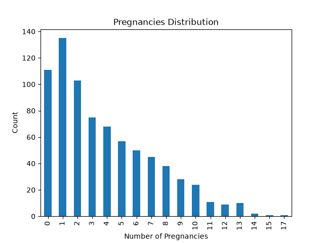
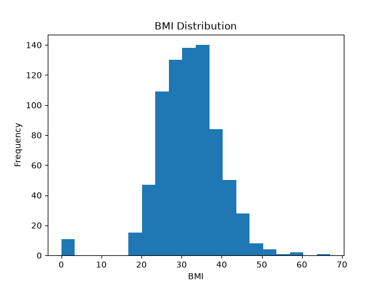
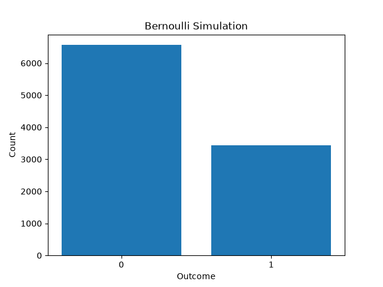

# Random Variables, Expected Value and Variance

## 1. Introduction

A random variable is a numerical representation of the outcome of a random process.

Random variables can be divided into two main types:

- Discrete random variables
- Continuous random variables

A discrete random variable has countable values, such as 0, 1, 2, 3, and so on.

A continuous random variable can take many possible values within a range, including decimal values.

In this analysis, several medical variables are examined using concepts such as expected value, variance, probability distributions, and simulation.

---

## 2. Dataset

The Pima Indians Diabetes Dataset was used.

The variables used in this analysis are:

- Outcome
- Pregnancies
- BMI
- Age

The dataset contains 768 observations.

---

## 3. Variable Types

The variables can be classified as follows:

| Variable | Type | Reason |
|---|---|---|
| Outcome | Discrete | It can only take the values 0 or 1 |
| Pregnancies | Discrete | It represents a count |
| Age | Discrete | It is recorded as whole years |
| BMI | Continuous | It can contain decimal values |

`Outcome` is also a Bernoulli random variable because it has only two possible outcomes:

```text
0 = No diabetes
1 = Diabetes
```

---

## 4. Expected Value

The expected value represents the long-term average value of a random variable.

For a discrete random variable:

```text
E[X] = Sum of x × P(X=x)
```

This means that each possible value is multiplied by its probability, and all results are added together.

---

## 5. Probability Distribution of Pregnancies

First, the frequency of each value of `Pregnancies` was calculated.

The probability of each value was then calculated using:

```text
P(X=x) = frequency / total observations
```

This creates an empirical probability distribution for the number of pregnancies.

---

## 6. Expected Value of Pregnancies

The expected value was calculated using:

```text
E[X] = Sum of x × P(X=x)
```

The result was:

```text
E[X] = 3.8451
```

Therefore, the expected number of pregnancies in this dataset is approximately:

```text
3.85
```

This number is an average and does not mean that an individual person can have exactly 3.85 pregnancies.

---

## 7. Variance of Pregnancies

To calculate the variance, the following value was first calculated:

```text
E[X²] = Sum of x² × P(X=x)
```

The result was:

```text
E[X²] = 26.1237
```

Variance was then calculated using:

```text
Var(X) = E[X²] - (E[X])²
```

The result was:

```text
Var(X) = 11.3393
```

Therefore:

```text
E[X] ≈ 3.85

Var(X) ≈ 11.34
```

The variance shows that the number of pregnancies has noticeable variation around its mean.

---

## 8. BMI Mean and Variance

BMI is treated as a continuous variable.

The mean BMI was:

```text
BMI Mean = 31.9926
```

Approximately:

```text
BMI Mean ≈ 31.99
```

The variance was:

```text
BMI Variance = 62.1600
```

Approximately:

```text
BMI Variance ≈ 62.16
```

The mean represents the center of the BMI values, while the variance describes how spread out the BMI values are around the mean.

---

## 9. Bernoulli Distribution

A Bernoulli random variable has only two possible values:

```text
X = 1
X = 0
```

For the `Outcome` variable:

```text
1 = Diabetes

0 = No Diabetes
```

The parameter `p` represents the probability that:

```text
X = 1
```

The calculated value was:

```text
p = 0.348958
```

Therefore:

```text
P(X=1) ≈ 34.9%

P(X=0) ≈ 65.1%
```

---

## 10. Expected Value of a Bernoulli Variable

For a Bernoulli random variable:

```text
E[X] = p
```

Therefore:

```text
E[X] = 0.348958
```

Approximately:

```text
E[X] ≈ 0.349
```

The reason is:

```text
E[X]

= 1 × P(X=1) + 0 × P(X=0)

= 1 × p + 0 × (1-p)

= p
```

---

## 11. Variance of a Bernoulli Variable

The variance of a Bernoulli variable is:

```text
Var(X) = p(1-p)
```

Using:

```text
p = 0.348958
```

the theoretical variance is:

```text
Var(X) = 0.227186
```

Approximately:

```text
Var(X) ≈ 0.2272
```

---

## 12. Bernoulli Simulation

A Bernoulli experiment was simulated 10,000 times.

Each simulated observation could only be:

```text
0 or 1
```

with:

```text
P(X=1) = 0.348958
```

The theoretical mean was:

```text
Theoretical Mean = 0.348958
```

The simulated mean was:

```text
Simulation Mean = 0.347
```

These values are very close.

The theoretical variance was:

```text
Theoretical Variance = 0.227186
```

The simulated variance was:

```text
Simulation Variance = 0.226591
```

These values are also very close.

This demonstrates that when a random experiment is repeated many times, the simulated results become close to the theoretical values.

Because the simulation is random, the exact simulated values may change slightly each time the program is executed.

---

## 13. Comparison of Theoretical and Simulated Results

| Measure | Theoretical | Simulation |
|---|---:|---:|
| Mean | 0.348958 | 0.347 |
| Variance | 0.227186 | 0.226591 |

The results show a strong agreement between the theoretical Bernoulli distribution and the simulation.

---

## 14. Pregnancies Distribution

The distribution of `Pregnancies` was visualized using a bar chart.



The horizontal axis represents the number of pregnancies.

The vertical axis represents the number of observations for each value.

---

## 15. BMI Distribution

BMI was visualized using a histogram.



A histogram is appropriate for BMI because BMI is a continuous variable.

The graph shows how BMI values are distributed across different ranges.

---

## 16. Bernoulli Simulation Distribution

The simulated Bernoulli values were visualized using a bar chart.



Because:

```text
p ≈ 0.349
```

approximately 35% of simulated values are expected to be 1 and approximately 65% are expected to be 0.

Therefore, the bar representing 0 should normally be taller than the bar representing 1.

---

# Analytical Questions

## 17. Which variables are discrete and which are continuous?

The variables can be classified as:

```text
Discrete:
Outcome
Pregnancies
Age

Continuous:
BMI
```

`Outcome` has only two possible values.

`Pregnancies` is a count.

`Age` is recorded in whole years in this dataset.

`BMI` can take decimal values and is therefore treated as continuous.

---

## 18. What is the expected value of Outcome?

Because `Outcome` is Bernoulli:

```text
E[X] = p
```

The estimated probability of `Outcome = 1` is:

```text
p = 0.348958
```

Therefore:

```text
E[X] ≈ 0.349
```

---

## 19. Why is the variance of a Bernoulli variable equal to p(1-p)?

For Bernoulli:

```text
X = 0 or 1
```

Therefore:

```text
X² = X
```

This means:

```text
E[X²] = p
```

We also know:

```text
E[X] = p
```

Using:

```text
Var(X) = E[X²] - (E[X])²
```

we obtain:

```text
Var(X)

= p - p²

= p(1-p)
```

---

## 20. Why is the mean not enough for skewed variables?

The mean only describes the center of the data.

If a dataset contains extremely high or low values, these values can strongly change the mean.

For example:

```text
2, 3, 3, 4, 100
```

Most values are close to 3, but the value 100 makes the mean much larger.

Therefore, for skewed variables, the mean should be considered together with other measures such as:

- Median
- Variance
- Standard deviation
- Shape of the distribution

---

## 21. What is the difference between discrete and continuous variables when calculating expected value?

For a discrete random variable, the expected value is calculated by summing:

```text
E[X] = Sum of x × P(X=x)
```

Discrete variables have countable possible values.

For continuous variables, theoretical expected value calculations use integration because there are infinitely many possible values in an interval.

When working with observed data, the sample mean can be calculated directly.

---

## 22. Is treatment cost discrete or continuous?

Treatment cost is usually modeled as a continuous variable.

It can take many numerical values within a range.

For example:

```text
120.50
125.75
200.25
```

Although money may be recorded using fixed units such as cents, it is commonly treated as a continuous variable in statistical modeling.

---

## 23. Why is the mean alone not enough in medical data?

Two groups can have similar means but very different levels of variation.

For example:

```text
Group A:
9, 10, 10, 10, 11

Group B:
2, 5, 10, 15, 18
```

Both groups have a similar center, but the second group is much more spread out.

Therefore, the mean alone cannot describe:

- Variability
- Extreme observations
- Skewness
- Shape of the distribution

Measures such as variance, standard deviation, median, and graphical distributions provide additional information.

---

## 24. Clinical Interpretation

Statistical measures such as the mean and variance describe different characteristics of medical data.

The mean shows the typical or central value.

Variance describes how different patients are from each other.

A large variance can indicate that patients have very different measurements even when the average value appears stable.

For this reason, both the center and the spread of medical data should be examined.

---

## 25. Conclusion

This analysis demonstrated the basic concepts of random variables, expected value, variance, and Bernoulli simulation.

The main findings were:

```text
Expected Pregnancies ≈ 3.85

Pregnancies Variance ≈ 11.34

Mean BMI ≈ 31.99

BMI Variance ≈ 62.16

P(Outcome=1) ≈ 0.349
```

The Bernoulli simulation produced:

```text
Simulation Mean ≈ 0.347

Simulation Variance ≈ 0.2266
```

These values were very close to the theoretical results:

```text
Theoretical Mean ≈ 0.349

Theoretical Variance ≈ 0.2272
```

The simulation therefore supports the theoretical properties of the Bernoulli distribution.

Overall, expected value describes the center of a random variable, while variance describes its spread. Both measures are important for understanding medical data.