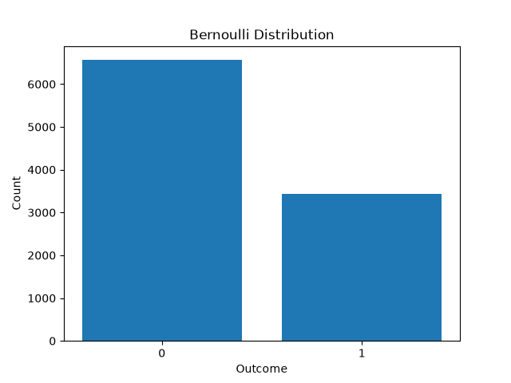
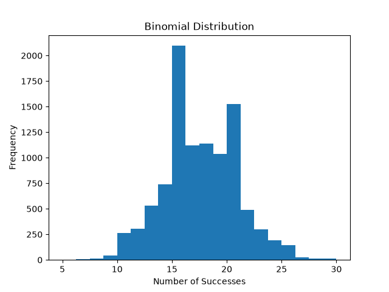
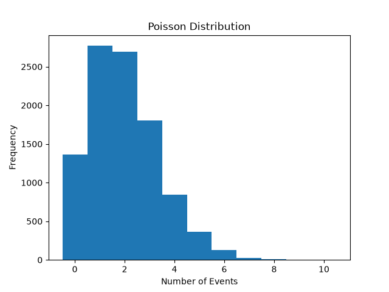
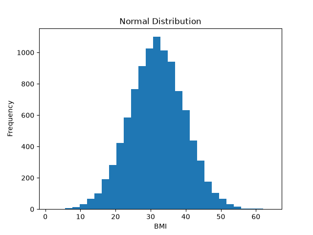

# Probability Distributions for Medical Variables

## 1. Introduction

Probability distributions help us describe the behavior of random variables.

Different types of variables require different probability distributions.

In this analysis, four important probability distributions are studied:

- Bernoulli
- Binomial
- Poisson
- Normal

The goal is to select an appropriate distribution for each type of variable, simulate each distribution, calculate specific probabilities, and compare theoretical results with simulation results.

---

## 2. Dataset

The Pima Indians Diabetes Dataset was used.

The main variables used are:

- Outcome
- BMI
- Glucose

The `Outcome` variable represents diabetes status:

```text
0 = No Diabetes
1 = Diabetes
```

The estimated probability of diabetes in the dataset is:

```text
p = 0.348958
```

Approximately:

```text
p = 34.9%
```

---

# 3. Distribution Selection

The selected distributions are:

| Scenario | Variable Type | Distribution |
|---|---|---|
| Diabetes status: yes/no | Discrete binary | Bernoulli |
| Number of diabetic patients in a group | Discrete count | Binomial |
| Number of events in a time interval | Discrete count | Poisson |
| BMI | Continuous | Normal |

---

# 4. Bernoulli Distribution

A Bernoulli random variable has only two possible outcomes:

```text
X = 0
X = 1
```

It is appropriate when a single experiment has two possible results.

For example:

```text
1 = Diabetes
0 = No Diabetes
```

The main parameter is:

```text
p = P(X=1)
```

In the dataset:

```text
p = 0.348958
```

Therefore:

```text
P(X=1) ≈ 34.9%

P(X=0) ≈ 65.1%
```

For a Bernoulli distribution:

```text
Mean = p

Variance = p(1-p)
```

The theoretical values are:

```text
Mean ≈ 0.348958

Variance ≈ 0.227186
```

---

# 5. Bernoulli Simulation

A total of 10,000 Bernoulli samples were generated.

Each simulated value was either:

```text
0 or 1
```

The simulation produced approximately:

```text
Simulation Mean = 0.3536

Simulation Variance = 0.228567
```

These values are close to the theoretical values.

This shows that the simulation behaves similarly to the theoretical Bernoulli distribution.

---

# 6. Binomial Distribution

A Binomial distribution represents the number of successes in several Bernoulli experiments.

Its two main parameters are:

```text
n = number of experiments

p = probability of success
```

In this analysis:

```text
n = 50

p = 0.348958
```

This means that each Binomial observation represents the number of successes in a group of 50 trials.

The theoretical mean of a Binomial distribution is:

```text
Mean = n × p
```

Therefore:

```text
Mean
= 50 × 0.348958
≈ 17.4479
```

The theoretical variance is:

```text
Variance = n × p × (1-p)
```

Therefore:

```text
Variance ≈ 11.3593
```

---

# 7. Binomial Simulation

A total of 10,000 Binomial samples were generated.

The simulation results were approximately:

```text
Simulation Mean = 17.5089

Simulation Variance = 11.5691
```

The theoretical and simulated values are close.

This means that in repeated groups of 50 trials, the average number of successes is expected to be approximately:

```text
17 to 18
```

---

# 8. Poisson Distribution

The Poisson distribution is used to model the number of events occurring in a fixed interval.

Examples include:

- Number of emergency visits in one day
- Number of infections in one month
- Number of medical events during a fixed time period

The main parameter is:

```text
λ = lambda
```

Lambda represents the average number of events in the interval.

In this analysis:

```text
λ = 2
```

A special property of the Poisson distribution is:

```text
Mean = λ

Variance = λ
```

Therefore:

```text
Theoretical Mean = 2

Theoretical Variance = 2
```

---

# 9. Poisson Simulation

A total of 10,000 Poisson samples were generated.

The simulation produced approximately:

```text
Simulation Mean = 2.001

Simulation Variance = 2.0244
```

Both values are very close to the theoretical value of 2.

This supports the theoretical property of the Poisson distribution that its mean and variance are equal.

---

# 10. Normal Distribution

The Normal distribution is a continuous probability distribution.

It is commonly represented by a symmetric bell-shaped curve.

The two main parameters are:

```text
μ = Mean

σ = Standard Deviation
```

For BMI:

```text
μ = 31.9926

σ = 7.8842
```

The theoretical variance is:

```text
Variance = σ²
```

Therefore:

```text
Variance ≈ 62.1600
```

---

# 11. Normal Simulation

A total of 10,000 Normal random values were generated using the BMI mean and standard deviation.

The simulation produced approximately:

```text
Simulation Mean = 31.8663

Simulation Variance = 61.2809
```

The theoretical values were:

```text
Theoretical Mean = 31.9926

Theoretical Variance = 62.1600
```

The simulated and theoretical values are close.

---

# 12. Probability of Exactly 7 Successes out of 10

Using the Binomial distribution, the probability of exactly 7 successes out of 10 trials was calculated.

The parameters were:

```text
n = 10

p = 0.348958

X = 7
```

The result was:

```text
P(X=7) = 0.020865
```

Approximately:

```text
P(X=7) ≈ 2.09%
```

Therefore, the probability of obtaining exactly 7 successes in 10 trials is about 2.1%.

---

# 13. Probability of Zero Poisson Events

For a Poisson distribution with:

```text
λ = 2
```

the probability of observing exactly zero events was calculated.

The result was:

```text
P(X=0) = 0.135335
```

Approximately:

```text
P(X=0) ≈ 13.53%
```

Therefore, even when the average number of events is 2, there is approximately a 13.5% probability that no event occurs in a particular interval.

---

# 14. Probability of BMI Greater Than 35

BMI was modeled using a Normal distribution with:

```text
μ = 31.9926

σ = 7.8842
```

The calculated probability was:

```text
P(BMI > 35) = 0.351434
```

Approximately:

```text
P(BMI > 35) ≈ 35.14%
```

Under the Normal model, there is therefore approximately a 35.1% probability that BMI is greater than 35.

---

# 15. Comparison of Theoretical and Simulation Results

| Distribution | Theoretical Mean | Simulation Mean | Theoretical Variance | Simulation Variance |
|---|---:|---:|---:|---:|
| Bernoulli | 0.348958 | 0.353600 | 0.227186 | 0.228567 |
| Binomial | 17.447917 | 17.508900 | 11.359321 | 11.569121 |
| Poisson | 2.000000 | 2.001000 | 2.000000 | 2.024399 |
| Normal | 31.992578 | 31.866315 | 62.159984 | 61.280885 |

For all four distributions:

```text
Simulation ≈ Theory
```

The small differences are expected because the simulations are random.

If the program is executed again, the simulated values may change slightly.

---

# 16. Bernoulli Distribution Plot

The Bernoulli simulation was visualized using a bar chart.



Because:

```text
p ≈ 0.349
```

approximately 35% of observations are expected to be 1, while approximately 65% are expected to be 0.

---

# 17. Binomial Distribution Plot

The Binomial simulation was visualized using a histogram.



Because the theoretical mean is approximately:

```text
17.45
```

many observations are expected to be concentrated around 17 or 18 successes.

---

# 18. Poisson Distribution Plot

The Poisson simulation was visualized using a histogram.



Because:

```text
λ = 2
```

the distribution is concentrated around small count values such as:

```text
0, 1, 2, 3, ...
```

The center of the distribution is approximately 2.

---

# 19. Normal Distribution Plot

The Normal simulation was visualized using a histogram.



The distribution is centered approximately around:

```text
μ ≈ 31.99
```

with:

```text
σ ≈ 7.88
```

---

# Analytical Questions

## 20. Why is Bernoulli appropriate for Outcome?

The `Outcome` variable has only two possible values:

```text
0 or 1
```

A Bernoulli distribution is specifically designed for a single experiment with two possible outcomes.

Therefore, Bernoulli is an appropriate distribution for modeling `Outcome`.

---

## 21. What is the difference between Bernoulli and Binomial?

Bernoulli describes one experiment with two possible outcomes:

```text
0 or 1
```

Binomial describes the total number of successes in multiple Bernoulli experiments.

In simple terms:

```text
Bernoulli
= one experiment

Binomial
= multiple Bernoulli experiments
```

For Binomial:

```text
n = number of experiments

p = probability of success
```

---

## 22. Why are the mean and variance equal in a Poisson distribution?

The Poisson distribution has one main parameter:

```text
λ
```

Its theoretical properties are:

```text
Mean = λ

Variance = λ
```

Therefore, both the expected number of events and the variance are determined by the same parameter.

For example:

```text
λ = 2
```

gives:

```text
Mean = 2

Variance = 2
```

---

## 23. What medical variables can be modeled using Poisson?

Poisson can be useful for count variables representing the number of events in a fixed interval.

Examples include:

- Number of emergency visits per day
- Number of infections per month
- Number of asthma attacks during a period
- Number of medication errors per month

The important idea is that the variable represents a count of events.

---

## 24. Why are not all medical variables Normally distributed?

Different medical variables have different properties.

Some variables are binary:

```text
0 or 1
```

Some are count variables:

```text
0, 1, 2, 3, ...
```

Some continuous variables may also be strongly skewed or contain extreme values.

Therefore, being a medical variable does not automatically mean that the variable follows a Normal distribution.

A Normal model is more reasonable when the distribution is approximately continuous, symmetric, and bell-shaped.

---

## 25. What if the variance of count data is larger than its mean?

For a Poisson distribution:

```text
Mean = Variance
```

If the variance is much larger than the mean, the data has more variability than the standard Poisson model expects.

This situation is called:

```text
Overdispersion
```

A common alternative model for overdispersed count data is the:

```text
Negative Binomial Distribution
```

This is an additional standard statistical interpretation; the assignment asks the question but does not specify the answer.

---

## 26. Is BMI Really Normally Distributed?

Using a Normal distribution for BMI is a modeling assumption.

BMI should not automatically be considered Normal only because it is continuous.

Its distribution can be examined using:

- Histogram
- Q-Q plot
- Skewness
- Normality tests

A histogram provides a simple visual check.

If the BMI distribution is approximately symmetric and bell-shaped, the Normal model may be reasonable.

If it is strongly skewed, contains large outliers, or has an unusual shape, the Normal model may not be appropriate.

The assignment asks for this evaluation but does not prescribe a specific normality test.

---

# 27. Clinical Interpretation

Different medical variables require different probability models.

Binary medical outcomes can be represented with Bernoulli distributions.

The number of successes in a group can be modeled using a Binomial distribution.

Counts of events over time may be modeled using a Poisson distribution.

Continuous measurements that are approximately symmetric may sometimes be modeled using a Normal distribution.

Selecting an appropriate probability distribution is important because the distribution determines how probabilities, means, variances, and other statistical quantities are calculated.

---

# 28. Conclusion

Four major probability distributions were examined:

```text
Bernoulli
Binomial
Poisson
Normal
```

The Bernoulli distribution was used for a binary outcome.

The Binomial distribution was used for counting successes over several trials.

The Poisson distribution was used for counting events in an interval.

The Normal distribution was used to model a continuous variable using a mean and standard deviation.

The simulation results were close to theoretical values for all four distributions.

The calculated probabilities were:

```text
P(exactly 7 successes out of 10)
≈ 2.09%

P(0 Poisson events)
≈ 13.53%

P(BMI > 35)
≈ 35.14%
```

Overall, the main lesson is that different kinds of variables require different probability distributions, and choosing the correct distribution is an important part of statistical analysis.