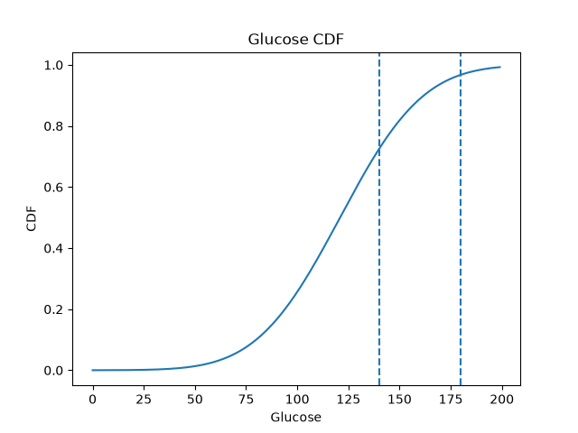

# CDF, Percentiles and Z-Score Analysis of Glucose

## 1. Introduction

The cumulative distribution function (CDF) shows the probability that a random variable is less than or equal to a specific value.

For a variable X:

```text
CDF(x) = P(X <= x)
```

Percentiles show the position of a value relative to the rest of a population.

The z-score shows how many standard deviations a value is above or below the mean.

In this analysis, Glucose is modeled using a Normal distribution.

---

## 2. Dataset

The Pima Indians Diabetes Dataset was used.

The main variables used in this analysis are:

- Glucose
- BMI

The main analysis focuses on Glucose.

The dataset contains 768 observations.

---

## 3. Glucose Parameters

The calculated mean of Glucose was:

```text
Glucose Mean = 120.8945
```

Approximately:

```text
Mean = 120.89
```

The calculated standard deviation was:

```text
Glucose Standard Deviation = 31.9726
```

Approximately:

```text
SD = 31.97
```

The Normal model therefore uses:

```text
Mean = 120.89
SD = 31.97
```

---

## 4. CDF of Glucose at 140

The probability that Glucose is less than or equal to 140 was:

```text
P(Glucose <= 140) = 0.724932
```

Approximately:

```text
P(Glucose <= 140) = 72.49%
```

This means that under the Normal model, approximately 72.5% of values are expected to be less than or equal to 140.

---

## 5. Probability of Glucose Above 140

The probability of Glucose being greater than 140 was calculated using:

```text
P(Glucose > 140)
=
1 - P(Glucose <= 140)
```

The result was:

```text
P(Glucose > 140) = 0.275068
```

Approximately:

```text
27.51%
```

Therefore, under the Normal model, approximately 27.5% of observations are expected to have Glucose above 140.

---

## 6. Probability of Glucose Between 100 and 140

The probability was calculated as:

```text
P(100 <= Glucose <= 140)
=
CDF(140) - CDF(100)
```

The result was:

```text
P(100 <= Glucose <= 140)
= 0.468220
```

Approximately:

```text
46.82%
```

Therefore, approximately 46.8% of observations are expected to be between 100 and 140.

---

# 7. Percentiles

The following percentiles were calculated using the Normal model:

| Percentile | Glucose |
|---|---:|
| 50th | 120.89 |
| 75th | 142.46 |
| 90th | 161.87 |
| 95th | 173.48 |
| 99th | 195.27 |

---

## 8. Interpretation of Percentiles

The 50th percentile is:

```text
120.89
```

This means that approximately 50% of the modeled Glucose values are below 120.89.

The 95th percentile is:

```text
173.48
```

This means that approximately:

```text
95%
```

of the modeled Glucose values are below 173.48.

Only approximately:

```text
5%
```

are expected to be above this value.

---

# 9. Z-Score

The z-score is calculated using:

```text
z = (x - Mean) / SD
```

For a patient with:

```text
Glucose = 180
```

the result was:

```text
z = 1.8486
```

Approximately:

```text
z = 1.85
```

This means that a Glucose value of 180 is approximately:

```text
1.85 standard deviations
```

above the mean.

---

# 10. Percentile of Glucose = 180

The calculated percentile was:

```text
0.967744
```

or:

```text
96.77%
```

Therefore, a Glucose value of 180 is approximately at the:

```text
96.8th percentile
```

This means that under the Normal model, approximately 96.8% of Glucose values are below 180.

Only approximately:

```text
3.2%
```

are above 180.

---

# 11. CDF Plot

The CDF of Glucose was plotted.



The graph includes:

- The Glucose CDF
- A reference line at Glucose = 140
- A reference line at Glucose = 180

The CDF increases from values close to 0 toward values close to 1.

As Glucose increases, the cumulative probability also increases.

---

# Analytical Questions

## 12. What is the difference between CDF and PDF?

CDF represents cumulative probability.

```text
CDF(x) = P(X <= x)
```

It answers:

> What proportion of the distribution is below or equal to x?

PDF describes the shape or density of a continuous probability distribution.

In simple terms:

```text
PDF
→ shape/density of the distribution

CDF
→ accumulated probability up to a value
```

---

## 13. What percentage of individuals have Glucose above 140?

The calculated probability was:

```text
P(Glucose > 140) = 0.275068
```

Therefore:

```text
approximately 27.51%
```

of the modeled population has Glucose above 140.

---

## 14. What is the 95th percentile of Glucose?

The calculated 95th percentile was:

```text
173.48
```

This means that approximately 95% of the modeled Glucose values are below 173.48.

---

## 15. What does z-score = 2 mean?

A z-score of 2 means that a value is:

```text
2 standard deviations above the mean
```

A positive z-score means the value is above the mean.

A negative z-score means the value is below the mean.

A z-score close to zero means the value is close to the mean.

---

## 16. Why is 140 used as the threshold?

In this assignment, 140 is provided as the clinical threshold for the analysis.

The source material does not provide the medical justification for why 140 was selected.

Therefore, in this report, 140 is treated as the given threshold used to calculate:

```text
P(Glucose <= 140)

P(Glucose > 140)
```

and to mark the threshold on the CDF graph.

---

## 17. Is the Normal model appropriate if Glucose is skewed?

Not necessarily.

The calculations in this analysis assume that Glucose follows a Normal distribution.

If the actual Glucose distribution is strongly skewed, the Normal model may not accurately represent the data.

In that situation, Normal-based probabilities and percentiles may be inaccurate.

Therefore, the distribution should ideally be checked before relying on the Normal assumption.

---

## 18. What percentile is a patient with Glucose = 180 in?

The calculated percentile was:

```text
96.77%
```

Therefore, Glucose = 180 is approximately at the:

```text
96.8th percentile
```

This means that the value is higher than approximately 96.8% of the modeled Glucose values.

It is therefore relatively high compared with the modeled population.

---

# 19. Clinical Interpretation

The CDF helps describe where a Glucose value lies relative to the overall distribution.

The threshold of 140 separates the distribution into two parts:

```text
Glucose <= 140
≈ 72.49%

Glucose > 140
≈ 27.51%
```

The z-score provides another way to describe the position of an observation relative to the mean.

For Glucose = 180:

```text
z ≈ 1.85
```

and:

```text
Percentile ≈ 96.77%
```

This indicates that 180 is relatively high compared with the modeled Glucose distribution.

---

# 20. Limitations

An important limitation of this analysis is the assumption that Glucose follows a Normal distribution.

The assignment explicitly asks us to make this assumption.

However, a continuous variable is not automatically Normally distributed.

If the actual data is skewed or contains unusual values, the Normal model may not provide accurate probabilities or percentiles.

Therefore, the Normal assumption should ideally be evaluated using methods such as:

- Histogram
- Q-Q plot
- Skewness
- Normality tests

---

# 21. Conclusion

The mean Glucose value was:

```text
120.89
```

and the standard deviation was:

```text
31.97
```

The main probability results were:

```text
P(Glucose <= 140)
≈ 72.49%

P(Glucose > 140)
≈ 27.51%

P(100 <= Glucose <= 140)
≈ 46.82%
```

The 95th percentile was:

```text
173.48
```

For a patient with:

```text
Glucose = 180
```

the z-score was:

```text
1.85
```

and the percentile was approximately:

```text
96.77%
```

Overall, CDF, percentiles, and z-scores provide useful ways to describe the position of a value relative to a probability distribution.

The main limitation is that these results depend on the assumption that Glucose follows a Normal distribution.